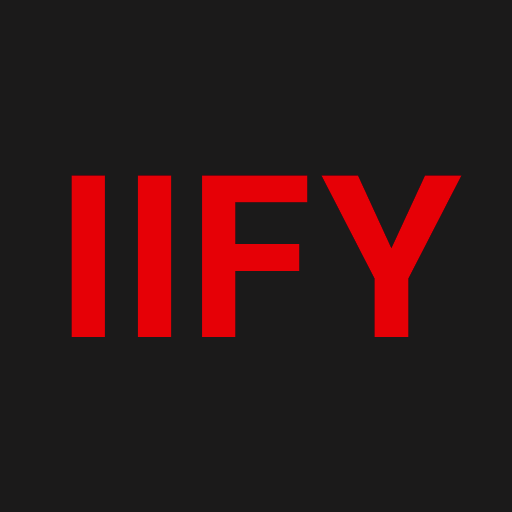

# IIFYBOT
## **Overview**
IIFYBOT (aka *"Is It Fix Yet?"* Bot) is a Slack Bot designed to aid in triaging and mitigating potential vulnerabilities within the Red Hat-based container images you are using for your application. IIFYBOT uses the [Red Hat Security Data API](https://access.redhat.com/documentation/en-us/red_hat_security_data_api/1.0/html/red_hat_security_data_api/index) to provide CVRF, CVE, and OVAL data, allowing users to quickly understand whether Red Hat has provided a fix for security issues regarding their Packages (RPMs). Additionally, IIFYBOT also uses the [Red Hat Catalog API](https://catalog.redhat.com/software/containers/search) to allow users to quickly get a listing of RPMs within the newest release of a selected Red Hat container image. With both previously mentioned data points, users can quickly understand if a fix has been released for a RPM and whether that fix is within the newest release of the Red Hat container image they are using, answering the question... **Is it Fixed Yet?**

----
## **Getting Started**
At this time, IIFYBOT is not a distributed Slack application. However, if you want to deploy your own instance of IIFYBOT, all the code is here to get you quickly set up! IIFYBOT uses the **Slack Bolt Framework for Python**, and Slack has done a fantastic job outlining how to set up your own Slack app. Follow [Slack's Guide for creating and setting up a Slack app](https://slack.dev/bolt-python/tutorial/getting-started-http), get your [Bot Token](https://api.slack.com/authentication/token-types#bot) and [Signing Secret](https://api.slack.com/authentication/verifying-requests-from-slack#signing_secrets_admin_page), link IIFYBOT's [slash commands to your own endpoint](https://api.slack.com/interactivity/slash-commands#creating_commands), and build and run the provided Dockerfile, and then you are off to the races.

### **Building & Running IIFYBOT Locally**
Use the provided Dockerfile to build the IIFYBOT container image.
```
docker build --no-cache -t iifybot:local .
```
Next run the IIFYBOT container image with the following command.
```
docker run \
	--env SLACK_BOT_TOKEN=<%YOUR-SLACK-BOT-TOKEN%> \
	--env SIGNING_SECRET=<%YOUR-SIGNING-SECRET%> \
	-p 5000:5000 \
	--name iifybot iifybot:local
```

----
## **The Commands**

- `/iify` - This command gives back Red Hat security information on one or more CVEs
    - EXAMPLE: `/iffy cve-xxxx-xxxxx` or `/iffy cve-xxxx-xxxxx cve-xxxx-xxxxx cve-xxxx-xxxxx`
- `/sbom` - Provide a Container Image name from the Red Hat Catalog and get a listing of the image's included RPMs and their version.
    - NOTE: This will only provide the RPMs of newest version of the Container Image provided.
    - EXAMPLE: `/iffy_sbom ubi8/ubi` or `/iffy_sbom rhel8/python-38`
- `/iifyhelp` - Provides a list of IIFYBOT command and their functions
- `/iifyart` - Provides a random piece of ASCII art created by the man, the myth, the legend Kent Aycoth
